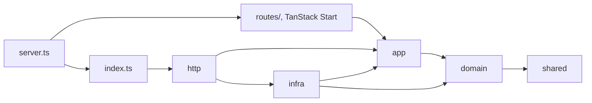
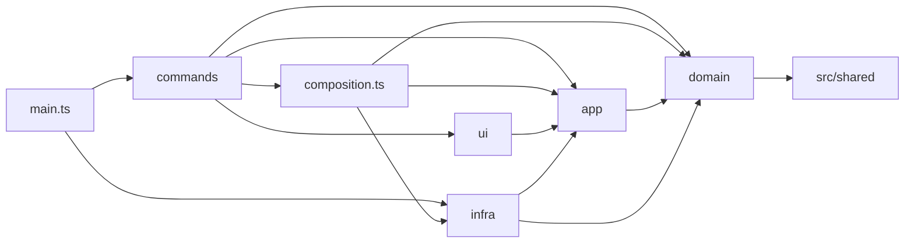

# Architecture

r2-lfs has two programs that share one small contract:

```
src/     the Worker: a Git LFS server on Cloudflare Workers, storing objects in R2, with an admin UI
cli/     the CLI: runs on developer machines and in CI, talks to git, the Worker and R2's S3 API
src/shared/contract.ts   bucket key layout, server info, the tokens file; imported by both
```

Both are split into layers with dependencies pointing inwards. The rules are enforced by
`no-restricted-imports` in [`.oxlintrc.json`](../.oxlintrc.json), so `pnpm lint` fails on a violation.
The CLI may import only `src/shared` from the Worker, and the Worker nothing from the CLI or Node.js.

## Worker (`src/`)

`src/server.ts` is the deployed entry. It hands `/_admin` to TanStack Start, whose routes live in
`src/routes/`, and every other path to `src/index.ts`, the Git LFS API on its own. Tests run the API
through `src/index.ts`, without Vite.



| Layer     | Holds                                                                                                     | May import                           |
| --------- | --------------------------------------------------------------------------------------------------------- | ------------------------------------ |
| `domain/` | Configuration parsing, permission rules, batch request validation, key layout                             | `shared/`                            |
| `app/`    | Use cases: authorize, batch, verify, download, upload. `ports.ts` declares what they need from outside.   | `domain/`, `shared/`                 |
| `infra/`  | Port implementations: R2 binding, presigned URLs, GitHub API, token directory                             | `app/ports.ts`, `domain/`, `shared/` |
| `http/`   | Routing, Request/Response mapping, composition of infra per request                                       | everything above                     |
| `routes/` | The admin UI under `/_admin` (TanStack Start), and `server.ts`, which routes requests to it or to the API | everything above                     |

Use cases return `Result` values with the HTTP status the LFS spec prescribes, so `http/` only maps
them to responses.

## CLI (`cli/`)



| Layer            | Holds                                                                                                                                      | May import                                                                                              |
| ---------------- | ------------------------------------------------------------------------------------------------------------------------------------------ | ------------------------------------------------------------------------------------------------------- |
| `domain/`        | gc planning, retention policy and globs, history aggregation, usage math, tar layout, token file edits                                     | `src/shared`, `smol-toml`                                                                               |
| `app/`           | Use cases (`init`, `doctor`, `migrate`, `usage`, `verify`, `why`, `gc`, `restore`, `archive`, `setup`, `token`) and `ports.ts`             | `domain/`, `src/shared`, `node:path`, `node:crypto`                                                     |
| `infra/`         | `Git` (git and git-lfs executables), `R2Bucket` (S3 API via aws4fetch), `HttpLfsClient`, `GhCli`, `NpxWrangler`, `LocalFiles`, `TarWriter` | `app/ports.ts`, `domain/`, `src/shared`, any `node:` module, `aws4fetch`                                |
| `ui/`            | `Terminal` (clack output, prompts, the `Reporter` implementation) and formatting                                                           | `app/ports.ts`, `domain/`, `src/shared`, `node:util`, `@clack/prompts`                                  |
| `composition.ts` | The only module that constructs adapters                                                                                                   | `infra/`, `app/ports.ts`, `domain/`, `node:url`                                                         |
| `commands/`      | citty definitions: parse arguments, ask questions, call a use case, render the result                                                      | `app/`, `domain/` (errors, types, presets), `ui/`, `composition.ts`, `src/shared`, `node:path`, `citty` |
| `main.ts`        | The entry point: lazy sub commands and turning errors into messages                                                                        | everything in `cli/`, `src/shared`, `citty`                                                             |

Use cases never print. They report progress through the `Reporter` port and return data, which
commands render as text or `--json`. Tests drive use cases with in-memory fakes
(`test/cli/helpers.ts`) and real temporary git repositories.

## Design decisions

**Bucket keys.** `per-repo` keys are `<owner>/<repo>/<oid>`, lowercased because GitHub names are
case-insensitive. `shared` keys are `_shared/<oid>`. `_trash/` and `_meta/` cannot collide with an
owner because GitHub logins never start with an underscore.

**No deletion in the Worker.** Anyone who can reach the Worker can at most read and add objects.
Deleting needs R2 API credentials, which only the CLI uses, and bucket lock rules can refuse even that.

**gc judges from git, not from access logs.** git-lfs does not download objects it already has, so
"not downloaded for a long time" would also match the current version of a file nobody changed.
gc instead keeps what branch and tag tips, recent commits and the policy reference.

**Copy, then delete.** R2 has no object versioning. gc copies an object to `_trash/` before deleting
it. If the delete fails, it removes the copy only after checking that the object is still there, so a
lock rule or a lost response never leaves the object in neither place.
Lock rules created by `setup` cover live prefixes only, so the trash can still expire.

**Tokens in the bucket.** Worker secrets are write-only, so a CLI cannot add one token to a list it
cannot read. `r2-lfs token` keeps SHA-256 hashes in `_meta/tokens.json` and writes it conditionally on
the ETag it read, so concurrent edits cannot drop each other's tokens.

**History reading.** `git log --all --raw -z` finds every version of every pointer in one pass;
`git rev-list --objects --no-walk` lists full trees of chosen commits without walking parents; only
blobs under 1 KiB are read, since pointer files are about 130 bytes.
